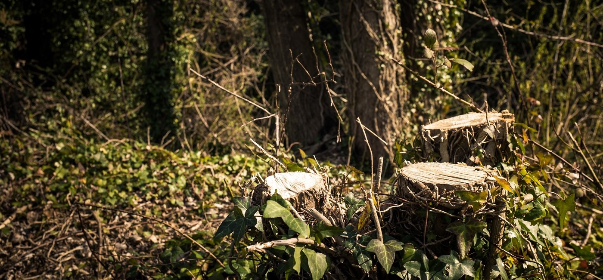

## Topic 2: Why and how does Trauma happen?

To develop a preliminary understanding of why trauma occurs, you have learned defining terms in the previous topic. This topic will focus on why and how PTSD develops and persists, we can tend to focus on the 'why' of abuse, however this is not something to discuss in the beginning. The learning activities included in this topic will allow you to explore the reasons why, even when an event or series of events occurred in the past, the brain and body can perceive the event as if it were happening right now.
Furthermore, the resources will discuss what happens to our brains when trauma occurs and persists over time. Despite some repetition in the different sources, the expectation is that you will retain more of the information by digesting it from various sources and formats.

&nbsp;

[plugin:content-inject](../_1-6)
[plugin:content-inject](../_1-7)
[plugin:content-inject](../_1-8)
[plugin:content-inject](../_1-9)
