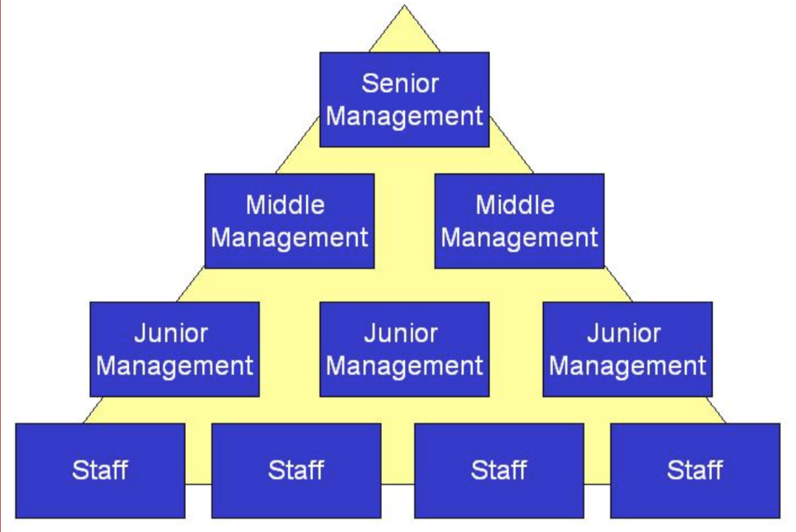

# Speaking as a Leader
### LDRS410
##### Chapters 1-4

---

# Begin with a ...

---

> The importance of a vision shapes everything a leader says and does.
> ~Humphries

---
# Chapter 1
Vision must be focused.  
Vision must be positive.  
Vision must be attainable.  
Vision should reflect the scope of your mandate (direction).  
Communicate your vision.  

---

# What is your vision?
...for this class?
...for the future?

---

# Chapter 2
## Think
#### beyond
###### hierarchies!

---

# Hierarchical Model

---

> Leaders at all levels must be willing to influence others, even those they don’t have authority over. ~Humphries

---
# Leading from below means one must…

> Be political, be direct, be bold! ~ Humphries

---

# Move from Informational to Inspirational

---

# Inspirational Approach

> Move your audience with the power of an idea and the passion that's behind that idea! ~Humphries

---

# What are the four critical mindsets to inspire?

---

# Chapter 4
> Replace negative thoughts with positive thoughts to create positive results. ~ Willie Nelson

---
# Consider

What are the rules to replace negative thoughts with positive thoughts?

---
# Take-Aways

Vision is important!  
Leading from below is the better model!  
Always *inspire*!  
Be positive!
